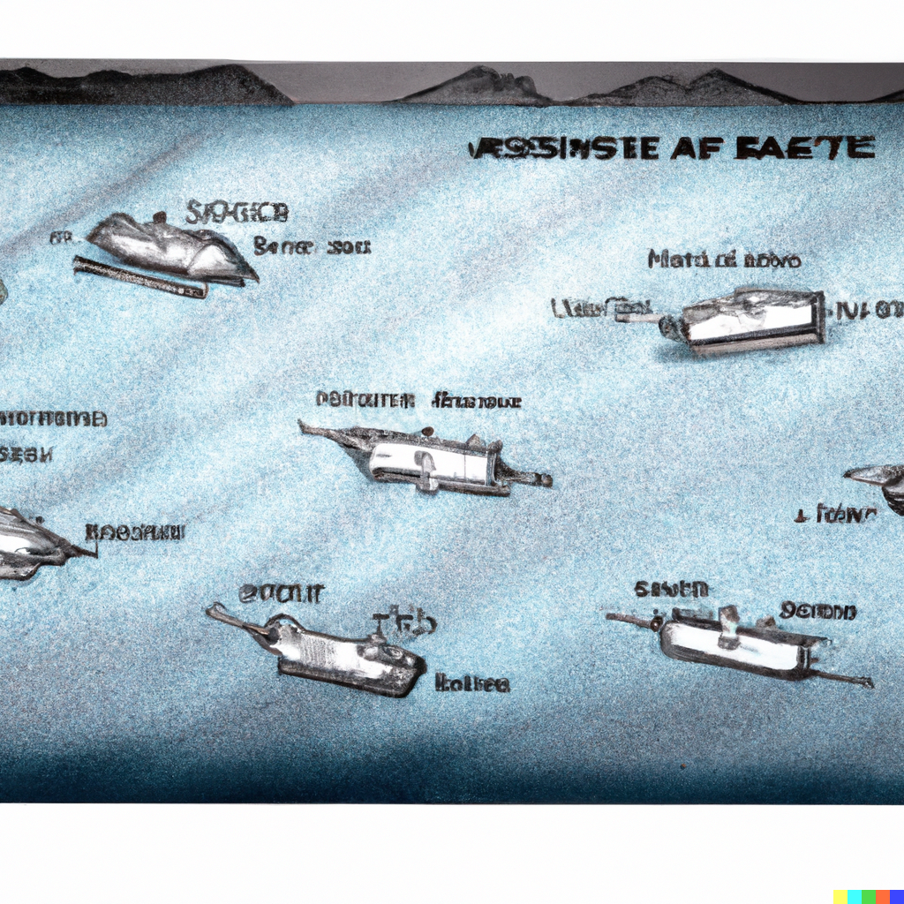

# Touched-Flowed



## Introduction

Touched-Flowed est un projet exploratoire développé en Go (Golang) qui vise à mettre en place la Clean Architecture tout en implémentant le célèbre jeu "Touché Coulé". Ce projet sert à la fois de terrain d'apprentissage pour le langage Go et comme exemple de mise en place de l'architecture propre dans un projet Go.

## Prérequis

Avant de pouvoir utiliser ce projet, assurez-vous d'avoir Go installé sur votre machine. Vous pouvez télécharger Go depuis [https://golang.org/dl/](https://golang.org/dl/).

## Configuration

1. Copiez le fichier `.env.example` et renommez-le en `.env`.

   ```bash
   cp .env.example .env
   ```

2. Copiez le fichier `sqitch.conf.example` et renommez-le en `sqitch.conf`.

   ```bash
   cp sqitch.conf.example sqitch.conf
   ```

   Vous pouvez ensuite personnaliser ces fichiers de configuration selon vos besoins.

## Exécution

### Lancer le serveur en mode développement

Pour exécuter le serveur en mode développement, utilisez la commande suivante :

```bash
make run
```

### Exécuter les tests

Pour exécuter les tests, utilisez la commande suivante :

```bash
make test
```

## Fonctionnalités

### Version 1 (en cours de développement)

La version 1 du projet Touched-Flowed a pour objectif d'ajouter les fonctionnalités suivantes :

- Inscription des utilisateurs
- Connexion des utilisateurs
- Jouer en mode 1 contre 1 en temps réel sur une carte 2D

Veuillez noter que, pour le moment, seule la partie backend du projet est en cours de développement. La partie frontend sera ajoutée dans les versions futures.

## Le Jeu "Touché Coulé"

"Touché Coulé" est un jeu de société bien connu où deux joueurs placent leurs bateaux sur une grille et tentent de deviner les positions des bateaux de l'adversaire en envoyant des "coups" sur la grille. Le premier joueur à couler tous les bateaux de l'adversaire gagne la partie. Touched-Flowed vise à recréer ce jeu en ligne, en utilisant une carte 2D pour représenter la grille.

## Contributeurs

- [Qwikle](https://github.com/qwikle)

## Licence

Ce projet est sous licence [MIT](LICENSE).
